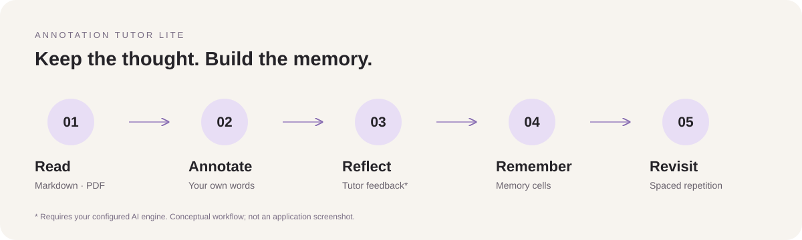

# Annotation Tutor Lite

**读到重要的地方，留下自己的理解。**

[English](README.md) · **简体中文**

为 Obsidian 桌面端打造：把原文高亮、纸感便签与 AI 辅助学习，连成属于你的 Markdown 记忆。


*AI 生成的阅读概念插画，不是应用截图。*

[开始使用](#开始使用) · [使用指南](docs/guide.md) · [更新记录](CHANGELOG.md)

## 让理解留在原文旁边

读论文时的一点疑问、表格里值得比较的数据、笔记中突然想通的一句话——让理解留在原文旁边，而不是散落在另一个窗口里。

选中文字，写下批注；点击高亮，重新打开便签。把便签拖到舒服的位置，移开鼠标，让按钮退到幕后。需要进一步思考时，再请你配置的 AI 导师点评，把这次阅读沉淀为可以回顾的学习记忆。

无需独立的批注数据库，也不强制注册 TutorLite 云端账号。你的笔记仍然是 Vault 中可以直接打开、编辑和迁移的 Markdown 文件。保存批注不需要 AI；点评、对话与翻译需要配置引擎。

## 0.2.4 这一轮更新

| 阅读材料 | 你可以怎样批注 |
| --- | --- |
| Markdown 笔记 | 高亮原文，点击打开可拖动的页边便签，在阅读上下文中保留理解。 |
| Markdown 表格 | 对单元格文字添加批注，不再向源表格插入新的块 ID；支持 Live Preview 与阅读模式下的高亮恢复。 |
| 可选中文字的 PDF | 从选区添加批注，恢复页面高亮，点击原文重新打开便签，通过页码回链返回来源。 |
| 所有现有便签皮肤 | 默认隐藏工具按钮，鼠标移入才显示，同时保留键盘操作焦点与触摸事件的访问入口。 |

### 像便签一样自然，而不是又一个工具面板

简洁、纸张、便利贴、叶片或自定义皮肤，都遵循同一套交互：静止时以文字为主，需要操作时才显示清楚的黑色图标。卡片在布局刷新时保留身份，减少拖动和编辑被重新创建打断的问题。在设置中启用页边批注，即可使用可拖动卡片。

我们希望保留的是“在原文旁写下想法”的轻盈感。纸感是视觉与交互设计，不代表已经实现手写笔输入。

### PDF 与 Markdown，共用一套高亮语言

PDF 批注使用与 Markdown 一致的高亮颜色变量和样式设置。独立高亮层不再受 PDF 透明文字层的二次淡化；点击按高亮区域判断，不要求先进入更深色状态才能响应。

**批注保存在 PDF 之外，不改写原始 PDF 文件。** 你可以回到原文阅读，也可以独立整理自己的学习记录。

## 从一次阅读，到可以反复调用的理解



1. **阅读与批注**：记录原文，用自己的话解释它。
2. **请求反馈**：由已配置的引擎点评你的理解，写入批注的 Agent Review 区段。
3. **沉淀记忆**：提炼带有依据的记忆单元，将相关概念组织成场景，维护学习者画像。
4. **再次遇见**：使用 SM-2 间隔重复安排复习，把学习材料汇成带回链的笔记本。

插件不附赠模型服务，也不保证 AI 点评总是正确。

## 阅读之外，也能连接你的学习材料

- **网页剪藏**：配套 Chromium 扩展保存网页高亮和批注，把选区或可读正文送进 Vault。[查看扩展说明 →](extension/README.md)
- **阅读辅助**：为支持的 Markdown 工作流提供行内释义和整篇笔记预翻译；不包含整份 PDF 正文抽取。
- **学习笔记本**：把批注、原文和概念连起来，回顾时不必重新寻找上下文。
- **四种界面语言**：English、简体中文、繁體中文、日本語。
- **文件式数据所有权**：批注、点评、记忆单元、场景与画像都是 Markdown；索引只是可重建的缓存。

## 开始使用

**当前为桌面插件**：Obsidian 1.12.4+，面向 macOS、Windows 和 Linux。Pad 手写属于设计规划，不是当前已交付的移动端能力。

### 安装当前源码版本

本页介绍的是源码版本 **0.2.4**。GitHub 最新发行版可能早于源码，请先核对版本号。要获得当前源码，需要 **Node 22.13+** 和 **pnpm 10**：

```bash
git clone https://github.com/Chain-Tang/AnnotationTutor.git
cd AnnotationTutor
pnpm install --frozen-lockfile
pnpm install:vault -- --vault "/path/to/YourVault"
```

安装命令会构建、复制插件文件并更新 Vault 的启用列表。请先保存正在编辑的批注，再重载 Obsidian，或关闭后重新启用插件。**复制新文件不等于运行中的旧插件已经重载。**

### 安装打包发行版

打开 [Releases](https://github.com/Chain-Tang/AnnotationTutor/releases)，确认版本及附件。如果有插件 ZIP，将其解压到 Vault 的 `.obsidian/plugins/` 下；也可将同一版本的 `main.js`、`manifest.json`、`styles.css` 放到：

```text
<你的Vault>/.obsidian/plugins/annotation-tutor-lite/
```

在 Obsidian 的第三方插件设置中启用 **Annotation Tutor Lite**。存在兼容发行版时，也可通过 BRAT 添加 `Chain-Tang/AnnotationTutor`；BRAT 不会安装尚未发布为发行版的源码改动。

### 写下第一条批注

1. 打开 Markdown 笔记或文字可选的 PDF。
2. 选中文字，按 `Ctrl/Cmd + Shift + L` 执行“添加学习批注”。PDF 也提供选区入口与右键菜单入口。
3. 写下理解并保存，点击原文高亮重新查看。需要可拖动便签时，在设置中启用页边批注。
4. 鼠标移到便签上显示按钮，移开后继续专注阅读和文字。

首次运行会建立记忆目录，默认名为 `Agent Memory/`；启用相应设置时，还会生成描述文件协议的 `AGENTS.md`。

## 连接你的导师

在 **设置 → Annotation Tutor Lite → General** 中选择引擎：

- **Direct API**：填写自己的 OpenAI 兼容端点、模型与 API 密钥。密钥保存在 Vault 本地插件配置中，不属于本仓库内容。
- **OpenCode**：自行安装并登录 CLI，再选择该引擎；插件通过 ACP 使用你已认证的 CLI。

**本地优先，不等于 AI 完全离线。** 请求点评、对话或翻译时，配置的远端引擎可能接收相关文本与上下文。服务商的隐私政策、数据保留、额度与费用独立于本插件；请勿把插件配置和密钥上传到公共仓库。

如果从 Dock 或桌面快捷方式启动的 Obsidian 找不到 CLI，可在引擎配置中填写可执行文件完整路径；插件也会搜索常见安装目录。

## 键盘快捷键

| 操作 | Windows / Linux | macOS |
| --- | --- | --- |
| 添加学习批注 | `Ctrl + Shift + L` | `⌘ + Shift + L` |
| 翻译选中内容 | `Alt + T` | `⌘ + Shift + T` |
| 预翻译整篇笔记 | `Ctrl + Alt + T` | `⌘ + Shift + Y` |

可在 Obsidian 的快捷键设置中重新绑定。macOS 默认避免会输入特殊字符的 Option 字母组合，其他命令也可以自行分配快捷键。

## 你的学习记忆，就是普通文件

```text
Agent Memory/
├── annotations/       # 每条批注一个 Markdown 文件
├── memory-cells/      # 有据可依的记忆与复习计划
├── scenes/            # 将相关概念组织到上下文中
├── profiles/          # 学习者画像与偏好
├── Notebook/          # 生成的学习笔记本
├── proposals/         # 确认模式下的审阅队列
└── AGENTS.md           # 给外部智能体的文件协议
```

原文引用、你的理解和代理点评分区保存。希望先审阅记忆变更时，可以启用确认模式。[了解数据模型与完整用法 →](docs/guide.md)

## 当前边界

- PDF 依赖阅读器文字层；无法选字的扫描件需先在其他工具中 OCR。批注不会导出为 PDF 内嵌评论。
- PDF 的“粗体”以更重的下划线强调，不修改画布上的原文字形。
- 表格重复文字按出现顺序匹配，尚无完整行列语义身份；无法确认归属的旧锚点不自动清除。
- PDF 前台物理鼠标操作及真实触屏设备仍需更广泛的端到端验证。DOM 回归不能替代所有 Obsidian 版本与主题的实际验收。
- 当前桌面版本没有实现笔迹、压感或移动端支持。

## 开发与反馈

```bash
pnpm typecheck
pnpm test
pnpm build
```

`pnpm dev` 监听构建；`pnpm package` 生成发行附件。0.2.4 本地验证通过 **62 个测试文件、531 项测试**，覆盖悬停按钮、拖动中刷新、PDF 事件路由、高亮样式和表格锚定。GitHub CI 独立运行 Linux、Windows 与 macOS 的构建和测试。

反馈交互问题时，请附上 Obsidian／插件版本、皮肤、视图模式、复现步骤，以及安装后是否确实重载了插件。尽量使用不含隐私信息的示例文档。

[使用指南](docs/guide.md) · [更新记录](CHANGELOG.md) · [表格与 PDF 实现笔记](docs/table-and-pdf-anchoring.md) · [Pad 设计提案](docs/pad-handwriting-spec.md)

## 许可证

[MIT](LICENSE) · © 2026 Chain。遵守许可证条款即可使用、修改与分发。
